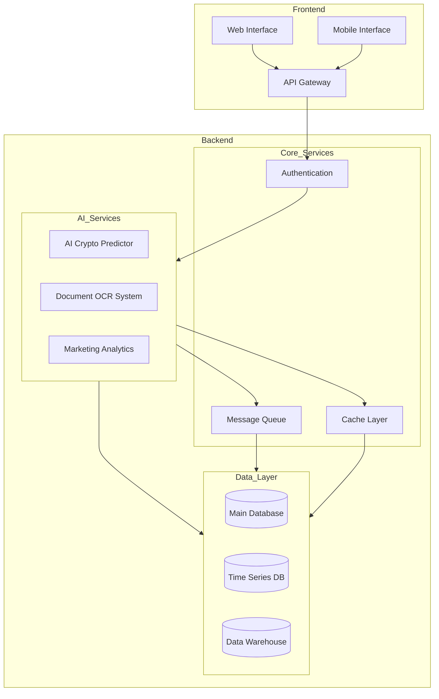
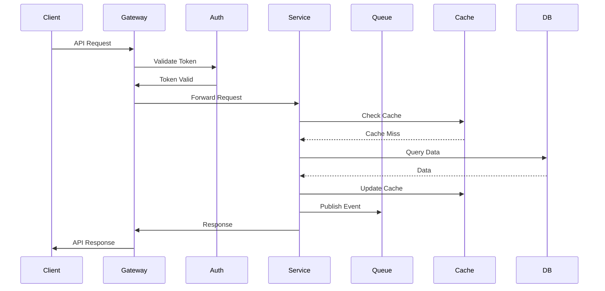
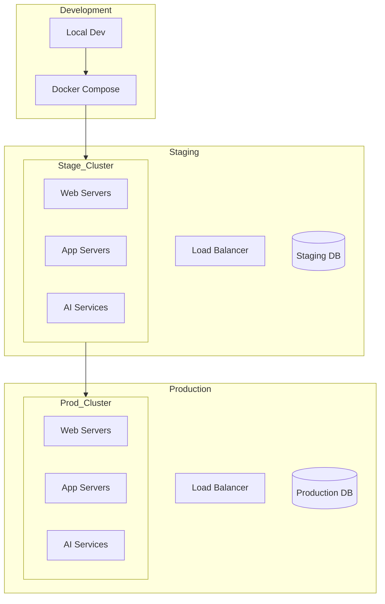

# Architecture Overview

This document provides a high-level overview of the AI-Driven Applications Suite architecture.

## System Architecture

## Component Breakdown

### Frontend Layer

1. **Web Interface**
   - React.js application
   - Material-UI components
   - Redux state management
   - WebSocket real-time updates

2. **Mobile Interface**
   - React Native application
   - Native UI components
   - Shared business logic with web

3. **API Gateway**
   - Nginx reverse proxy
   - Rate limiting
   - Request routing
   - SSL termination

### AI Services

1. **AI Crypto Price Predictor**
   - TensorFlow models
   - Time series analysis
   - Market sentiment analysis
   - Real-time predictions

2. **Document OCR System**
   - Tesseract OCR engine
   - Custom document processors
   - Image preprocessing
   - Text extraction and analysis

3. **Marketing Analytics Tool**
   - Predictive analytics
   - Customer segmentation
   - Campaign optimization
   - Reporting engine

### Core Services

1. **Authentication Service**
   - JWT token management
   - Role-based access control
   - OAuth2 integration
   - Session management

2. **Message Queue**
   - Redis pub/sub
   - Task scheduling
   - Event distribution
   - Worker coordination

3. **Cache Layer**
   - Redis caching
   - Cache invalidation
   - Distributed locking
   - Session storage

### Data Layer

1. **Main Database (PostgreSQL)**
   - User data
   - Application state
   - Transactional data
   - Audit logs

2. **Time Series Database (InfluxDB)**
   - Market data
   - Performance metrics
   - System telemetry
   - Real-time analytics

3. **Data Warehouse (ClickHouse)**
   - Historical data
   - Analytics storage
   - Reporting data
   - Machine learning datasets

## Inter-Service Communication

## Security Architecture

1. **Network Security**
   - VPC isolation
   - Security groups
   - Network ACLs
   - WAF rules

2. **Application Security**
   - Input validation
   - Output encoding
   - CSRF protection
   - XSS prevention

3. **Data Security**
   - Encryption at rest
   - Encryption in transit
   - Key management
   - Secure backup

4. **Access Control**
   - Role-based access
   - API authentication
   - Token validation
   - Audit logging

## Deployment Architecture

## Monitoring and Observability

1. **Metrics Collection**
   - System metrics
   - Application metrics
   - Business metrics
   - Custom metrics

2. **Logging**
   - Centralized logging
   - Log aggregation
   - Log analysis
   - Error tracking

3. **Tracing**
   - Distributed tracing
   - Performance profiling
   - Bottleneck detection
   - Request tracking

4. **Alerting**
   - Alert rules
   - Alert routing
   - Alert aggregation
   - On-call rotation

## Scalability Considerations

1. **Horizontal Scaling**
   - Service replication
   - Load balancing
   - Auto-scaling
   - Failover

2. **Vertical Scaling**
   - Resource optimization
   - Performance tuning
   - Capacity planning
   - Upgrade paths

3. **Data Scaling**
   - Data partitioning
   - Sharding strategy
   - Replication
   - Backup strategy

## Development Workflow

1. **Local Development**
   - Docker Compose setup
   - Hot reloading
   - Debug tools
   - Test environment

2. **CI/CD Pipeline**
   - Automated testing
   - Code quality checks
   - Security scans
   - Deployment automation

3. **Release Process**
   - Version control
   - Change management
   - Release notes
   - Rollback procedures

## Future Considerations

1. **Technical Debt**
   - Code refactoring
   - Architecture improvements
   - Performance optimization
   - Security enhancements

2. **New Features**
   - AI model improvements
   - Additional services
   - Integration options
   - Platform expansion

3. **Infrastructure**
   - Cloud migration
   - Container orchestration
   - Service mesh
   - Serverless options
