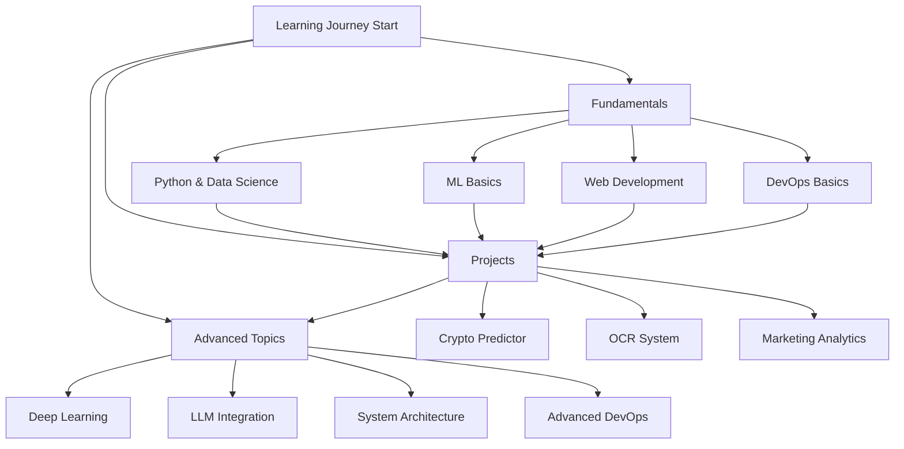
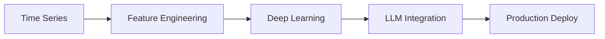
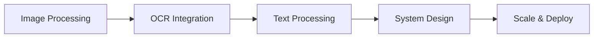
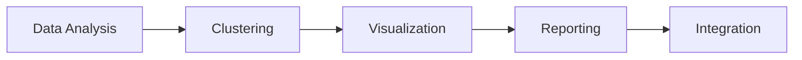
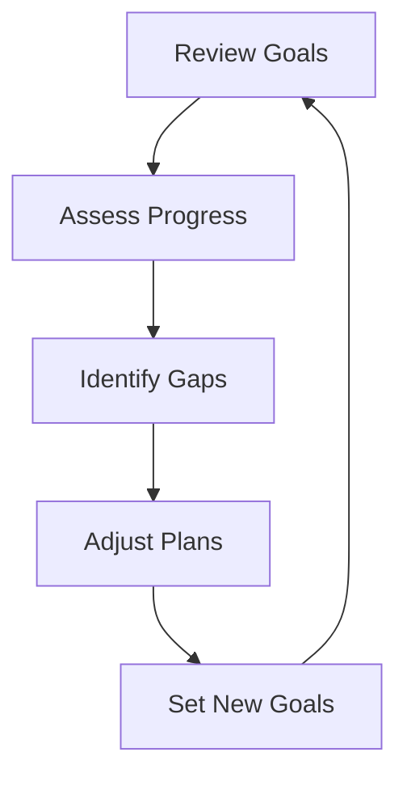

# AI Development Learning Journey

## Overview

This document outlines the learning path and progression through AI development concepts, providing a structured approach to mastering the technologies used in the portfolio projects.

## Learning Path Visualization



## Skills Matrix

### Core Technologies

| Skill Area | Basic | Intermediate | Advanced | Expert |
|------------|-------|--------------|----------|--------|
| Python | ☐ Setup & Syntax | ☐ OOP & Libraries | ☐ Advanced Patterns | ☐ Framework Design |
| JavaScript | ☐ ES6 Basics | ☐ Node.js | ☐ TypeScript | ☐ Full-stack |
| SQL | ☐ CRUD | ☐ Joins & Views | ☐ Optimization | ☐ Architecture |
| Git | ☐ Basic Commands | ☐ Branching | ☐ Advanced Ops | ☐ Git Flow |

### AI/ML Technologies

| Skill Area | Basic | Intermediate | Advanced | Expert |
|------------|-------|--------------|----------|--------|
| ML Basics | ☐ Concepts | ☐ scikit-learn | ☐ Custom Models | ☐ Research |
| Deep Learning | ☐ Neural Nets | ☐ CNN/RNN | ☐ Advanced Arch | ☐ Novel Arch |
| LLMs | ☐ API Usage | ☐ Prompt Eng | ☐ Fine-tuning | ☐ Custom Models |
| Computer Vision | ☐ OpenCV | ☐ Object Detection | ☐ Advanced CV | ☐ Novel Methods |

## Project-Based Learning

### 1. AI Crypto Price Predictor

#### Learning Objectives



#### Skills Development

- [ ] Time series analysis
- [ ] Feature engineering
- [ ] Deep learning models
- [ ] LLM integration
- [ ] API development
- [ ] Real-time processing

### 2. Document Digitization OCR System

#### Learning Objectives



#### Skills Development

- [ ] Computer vision
- [ ] OCR technologies
- [ ] Document processing
- [ ] Distributed systems
- [ ] Performance optimization
- [ ] Cloud services

### 3. University Marketing Analytics Tool

#### Learning Objectives



#### Skills Development

- [ ] Data preprocessing
- [ ] Machine learning
- [ ] Statistical analysis
- [ ] Data visualization
- [ ] Report generation
- [ ] Business intelligence

## Learning Resources

### Online Courses

1. Machine Learning
   - Coursera Machine Learning Specialization
   - Fast.ai Deep Learning Course
   - Stanford CS224N (NLP)

2. Software Development
   - Clean Code Principles
   - System Design
   - Cloud Architecture

3. DevOps & Tools
   - Docker & Kubernetes
   - CI/CD Pipelines
   - Monitoring & Logging

### Books

1. AI/ML
   - "Deep Learning" by Goodfellow et al.
   - "Hands-On Machine Learning" by Géron
   - "Natural Language Processing" by Eisenstein

2. Software Engineering
   - "Clean Code" by Robert Martin
   - "Design Patterns" by GoF
   - "Building Microservices" by Newman

### Practice Projects

1. Starter Projects
   - Simple ML models
   - Basic web applications
   - Data analysis notebooks

2. Intermediate Challenges
   - API integrations
   - Database optimizations
   - Deployment automation

3. Advanced Projects
   - Custom ML frameworks
   - Distributed systems
   - Novel algorithms

## Progress Tracking

### Weekly Review Template

```markdown
## Week X Review

### Accomplishments
- [ ] Technical skills gained
- [ ] Projects advanced
- [ ] Concepts mastered

### Challenges
- [ ] Technical obstacles
- [ ] Knowledge gaps
- [ ] Time management

### Next Week's Goals
- [ ] Learning objectives
- [ ] Project milestones
- [ ] Skills to develop
```

### Monthly Assessment

```markdown
## Month X Assessment

### Skills Progress
- Technical: [Basic/Intermediate/Advanced]
- Project Work: [%] complete
- Knowledge Areas: [List mastered topics]

### Areas for Improvement
- [ ] Identified gaps
- [ ] Required resources
- [ ] Action plans

### Next Month's Focus
- [ ] Primary learning goals
- [ ] Project targets
- [ ] Skill development
```

## Contribution & Collaboration

### Knowledge Sharing

- Blog posts
- Documentation
- Code reviews
- Team presentations

### Community Involvement

- Open source contributions
- Stack Overflow participation
- Conference attendance
- Meetup participation

## Career Development

### Short-term Goals (3-6 months)

- [ ] Complete fundamental courses
- [ ] Build portfolio projects
- [ ] Master core technologies

### Mid-term Goals (6-12 months)

- [ ] Advanced certifications
- [ ] Specialized expertise
- [ ] Project leadership

### Long-term Goals (1-2 years)

- [ ] Industry recognition
- [ ] Technical leadership
- [ ] Innovation contributions

## Reflection & Adaptation

### Quarterly Review



### Success Metrics

- Technical proficiency
- Project completion
- Knowledge sharing
- Community impact
- Career advancement

Remember to update this document regularly as you progress through your learning journey. Use it as a living document to track your growth and adjust your learning path as needed.
