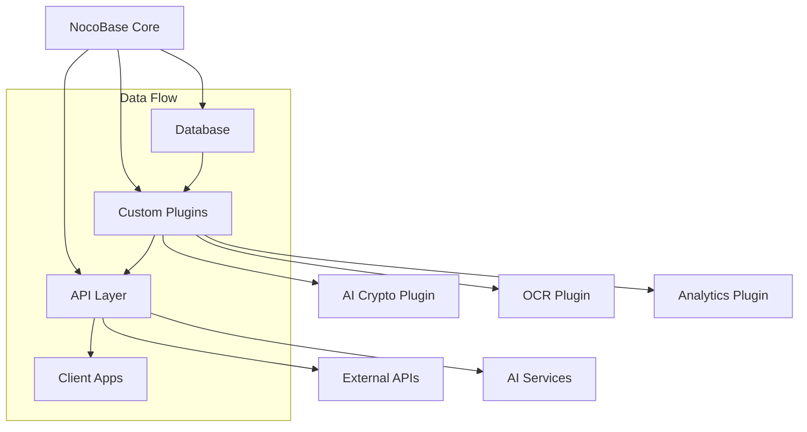
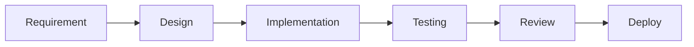

# NocoBase Integration & Management Guide

## Overview

This document provides comprehensive guidance for managing the NocoBase integration within our AI portfolio projects, including setup, customization, and maintenance procedures.

## Architecture Overview



## Local Development Setup

### Initial Setup

#### 1. Download with Git

##### Latest version (main)

###### Stable and well-tested version and only bug fixed will be made. This version is recommended

```bash
git clone https://github.com/nocobase/nocobase.git -b main --depth=1 nocobase
```

##### Beta version (next)

###### This version includes new features that are about to be released and it has been preliminarily tested, but still have known or unknown issues.

```bash
git clone https://github.com/nocobase/nocobase.git -b next --depth=1 nocobase
```

##### Alpha version (develop)

###### A development version containing the latest features, which may be incomplete or unstable

```bash
git clone https://github.com/nocobase/nocobase.git -b develop --depth=1 nocobase
```

#### 2. Switch to the project directory

```bash
cd nocobase
```

#### 3. Install dependencies

```bash
yarn install --frozen-lockfile
```

#### 4. Set environment variables

##### The environment variables required by NocoBase are stored in the root .env file, modify the environment variables according to the actual situation, if you don't know how to change them, click here for environment variables description, or you can leave it as default.

```bash
TZ=UTC
APP_KEY=your-secret-key
DB_HOST=localhost
DB_PORT=5432
DB_DATABASE=postgres
DB_USER=nocobase
DB_PASSWORD=nocobase
NOCOBASE_PKG_USERNAME=your-username
NOCOBASE_PKG_PASSWORD=your-password
```

```plaintext
WARNING:
Version 1.4 and above: By setting the environment variables NOCOBASE_PKG_USERNAME and NOCOBASE_PKG_PASSWORD, you can automatically download commercial plugins during application installation or upgrade;
TZ is used to set the application's time zone, with the default being the system's time zone;
APP_KEY is the application's secret key, used for generating user tokens and so on (if APP_KEY is changed, the old tokens will also become invalid). It can be any random string. Please change it to your own secret key and ensure it is not disclosed to the public.
DB_* is related to the database. If it is not the default database service in the example, please modify it according to the actual situation.
```

#### 5. Install NocoBase

```bash
yarn nocobase install --lang=en-US
```

#### 6. Start NocoBase

Development

```bash
yarn dev
```

Production

```bash
# Build (make sure you have executed `yarn install --frozen-lockfile`, note that it does not include `--production`)
yarn build
# Start
yarn start
```

#### 7. Log in to NocoBase

Open http://localhost:13000 in a web browser. The initial account and password are admin@nocobase.com and admin123.

### Database Configuration

```yaml
# config/database.yml
development:
  dialect: postgres
  host: localhost
  port: 5432
  username: your_username
  password: your_password
  database: nocobase_dev
```

## Plugin Development

### Plugin Structure

```plaintext
plugins/
└── your-plugin/
    ├── package.json
    ├── src/
    │   ├── server/
    │   │   ├── index.ts
    │   │   └── models/
    │   └── client/
    │       ├── index.tsx
    │       └── components/
    └── test/
```

### Plugin Template

```typescript
// src/server/index.ts
import { Plugin } from '@nocobase/server';

export class YourPlugin extends Plugin {
  async load() {
    // Register collections
    this.db.collection({
      name: 'your_collection',
      fields: [
        // Define fields
      ],
    });

    // Register actions
    this.app.resource({
      name: 'your_resource',
      actions: {
        // Define actions
      },
    });
  }
}
```

## Custom Collections

### AI Data Models

```typescript
// Example: Crypto predictions collection
this.db.collection({
  name: 'crypto_predictions',
  fields: [
    {
      type: 'string',
      name: 'cryptocurrency',
    },
    {
      type: 'decimal',
      name: 'predicted_price',
    },
    {
      type: 'integer',
      name: 'confidence',
    },
    {
      type: 'datetime',
      name: 'prediction_time',
    },
  ],
});
```

### Document Management

```typescript
// Example: OCR documents collection
this.db.collection({
  name: 'processed_documents',
  fields: [
    {
      type: 'string',
      name: 'title',
    },
    {
      type: 'json',
      name: 'metadata',
    },
    {
      type: 'text',
      name: 'content',
    },
    {
      type: 'integer',
      name: 'status',
    },
  ],
});
```

## API Integration

### Custom Actions

```typescript
// Example: AI processing action
this.app.resource({
  name: 'ai_processor',
  actions: {
    async process(ctx, next) {
      const { resourceName, data } = ctx.action.params;
      const result = await this.processWithAI(data);
      ctx.body = result;
      await next();
    },
  },
});
```

### Middleware Setup

```typescript
// Example: Authentication middleware
this.app.middleware.use(async (ctx, next) => {
  const token = ctx.get('Authorization');
  if (!token) {
    ctx.throw(401);
  }
  await next();
});
```

## Development Workflow

### 1. Feature Implementation



### 2. Testing Strategy

```typescript
// Example: Integration test
describe('AI Plugin', () => {
  it('should process data correctly', async () => {
    const app = await createApp();
    const response = await app
      .agent()
      .resource('ai_processor')
      .process({
        data: testData,
      });
    expect(response.status).toBe(200);
  });
});
```

## Maintenance & Updates

### Version Control

```bash
# Update NocoBase
git checkout main
git pull upstream main

# Update plugins
cd plugins/your-plugin
yarn upgrade @nocobase/server @nocobase/client
```

### Database Migrations

```bash
# Create migration
yarn nocobase db:migrate:create

# Run migrations
yarn nocobase db:migrate
```

## Troubleshooting Guide

### Common Issues

1. **Database Connection**

```bash
# Check database status
yarn nocobase db:auth
```

2. **Plugin Loading**

```bash
# Check plugin status
yarn nocobase plugin:list
```

3. **Build Issues**

```bash
# Clean and rebuild
yarn clean
yarn build
```

## Performance Optimization

### Caching Strategy

```typescript
// Example: Redis caching implementation
import { Redis } from 'ioredis';

const redis = new Redis();

async function getCachedData(key: string) {
  const cached = await redis.get(key);
  if (cached) {
    return JSON.parse(cached);
  }
  const data = await fetchData();
  await redis.set(key, JSON.stringify(data), 'EX', 3600);
  return data;
}
```

### Query Optimization

```typescript
// Example: Optimized query
const result = await this.db.collection('large_collection')
  .find()
  .select(['id', 'name'])
  .limit(10)
  .lean()
  .exec();
```

## Security Considerations

### Authentication

```typescript
// Example: JWT implementation
import jwt from 'jsonwebtoken';

export const createToken = (user) => {
  return jwt.sign(
    { id: user.id },
    process.env.JWT_SECRET,
    { expiresIn: '24h' }
  );
};
```

### Data Protection

```typescript
// Example: Data encryption
import crypto from 'crypto';

export const encryptSensitiveData = (data: string) => {
  const cipher = crypto.createCipher('aes-256-cbc', process.env.ENCRYPTION_KEY);
  return cipher.update(data, 'utf8', 'hex') + cipher.final('hex');
};
```

## Learning Resources

### Official Documentation

- [NocoBase Documentation](https://docs.nocobase.com/)
- [API Reference](https://docs.nocobase.com/api)
- [Plugin Development Guide](https://docs.nocobase.com/plugins)

### Community Resources

- GitHub Discussions
- Discord Channel
- Stack Overflow Tags

### Best Practices

1. Follow NocoBase coding standards
2. Write comprehensive tests
3. Document all custom implementations
4. Keep dependencies updated
5. Monitor performance metrics

Remember to keep this guide updated as NocoBase evolves and new patterns emerge.
