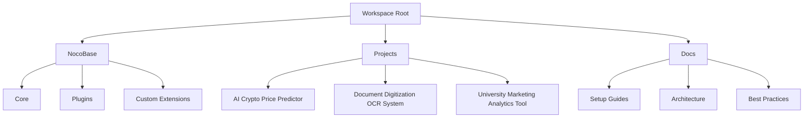
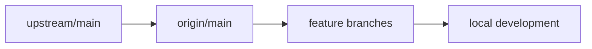
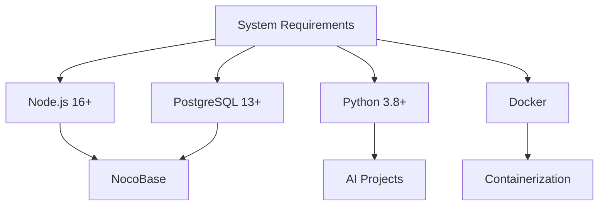
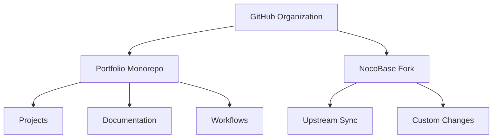
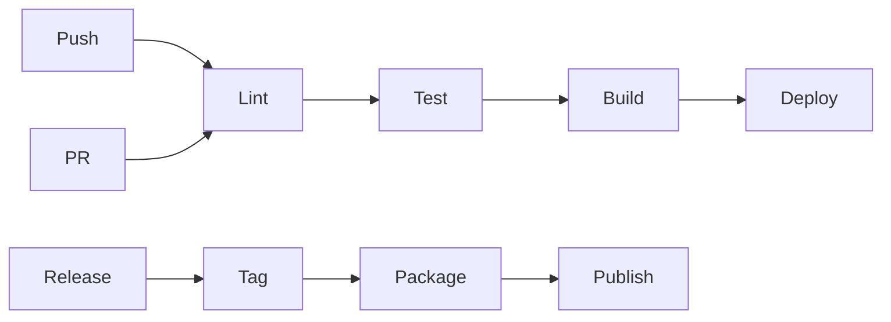
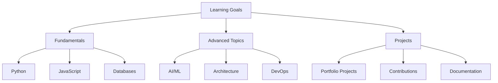

# Workspace Setup & Management Guide

## Overview

This document outlines the workspace structure, development environment setup, and best practices for managing the AI portfolio projects alongside the NocoBase integration.

## Workspace Architecture



## Directory Structure

```
workspace/
├── .github/                    # GitHub workflows and templates
├── docs/                      # Documentation
│   ├── architecture/         # System design docs
│   ├── guides/              # Development guides
│   ├── nocobase/           # NocoBase management
│   └── learning/          # Learning resources
├── nocobase/             # NocoBase local clone
├── projects/            # Portfolio projects
└── scripts/           # Utility scripts
```

## NocoBase Management

### Local Clone Setup

```bash
# Initial setup
git clone https://github.com/nocobase/nocobase.git
cd nocobase
yarn install
yarn build
yarn start

# Create development database
yarn db:create
yarn db:migrate
```

### Branch Management



### Update Process

1. Sync with upstream:

```bash
git remote add upstream https://github.com/nocobase/nocobase.git
git fetch upstream
git checkout main
git merge upstream/main
```

2. Handle custom changes:

```bash
# Create feature branch
git checkout -b feature/custom-enhancement

# After development
git checkout main
git merge feature/custom-enhancement
```

## Development Environment

### Prerequisites Installation



### Environment Configuration

```yaml
# .env structure
WORKSPACE_ROOT=/path/to/workspace
NOCOBASE_PATH=${WORKSPACE_ROOT}/nocobase
PROJECTS_PATH=${WORKSPACE_ROOT}/projects

# NocoBase settings
DB_HOST=localhost
DB_PORT=5432
DB_USERNAME=postgres
DB_PASSWORD=postgres
DB_DATABASE=nocobase

# Project settings
PYTHON_VENV_PATH=${WORKSPACE_ROOT}/.venv
```

## Git & GitHub Management

### Repository Structure



### Workflow Guidelines

1. **Branch Naming**:
   - `feature/*`: New features
   - `fix/*`: Bug fixes
   - `docs/*`: Documentation
   - `refactor/*`: Code refactoring

2. **Commit Standards**:

```
<type>(<scope>): <description>

[optional body]

[optional footer]
```

3. **PR Process**:
   - Create feature branch
   - Develop changes
   - Run tests
   - Submit PR
   - Code review
   - Merge

## CI/CD Pipeline



### GitHub Actions Configuration

```yaml
name: CI/CD Pipeline

on:
  push:
    branches: [ main, develop ]
  pull_request:
    branches: [ main ]

jobs:
  validate:
    runs-on: ubuntu-latest
    steps:
      - name: Checkout code
        uses: actions/checkout@v2

      - name: Lint code
        run: |
          yarn lint
          flake8 .

      - name: Run tests
        run: |
          yarn test
          pytest

  build:
    needs: validate
    runs-on: ubuntu-latest
    steps:
      - name: Build projects
        run: |
          yarn build
          python setup.py build

  deploy:
    needs: build
    if: github.ref == 'refs/heads/main'
    runs-on: ubuntu-latest
    steps:
      - name: Deploy
        run: |
          # Deployment steps
```

## Learning Path Integration

### Progress Tracking



### Documentation Organization

1. **Learning Resources**
   - Tutorials
   - Code examples
   - Best practices
   - External references

2. **Project Documentation**
   - Architecture decisions
   - Implementation details
   - Learning outcomes
   - Future improvements

3. **Knowledge Base**
   - Technical concepts
   - Problem-solving approaches
   - Lessons learned
   - Tips and tricks

## Monitoring & Maintenance

### Health Checks

- Repository status
- Dependencies updates
- Security scanning
- Performance metrics

### Regular Tasks

- Dependency updates
- Security patches
- Documentation reviews
- Code cleanup

## Best Practices

1. **Code Quality**
   - Linting configuration
   - Testing standards
   - Documentation requirements
   - Review guidelines

2. **Security**
   - Secrets management
   - Access control
   - Vulnerability scanning
   - Update policies

3. **Performance**
   - Optimization guidelines
   - Resource management
   - Monitoring setup
   - Benchmarking

Remember to keep this documentation updated as the workspace evolves and new best practices are established.
